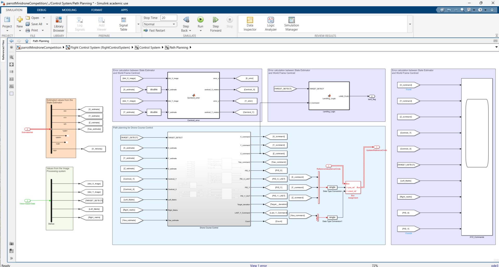
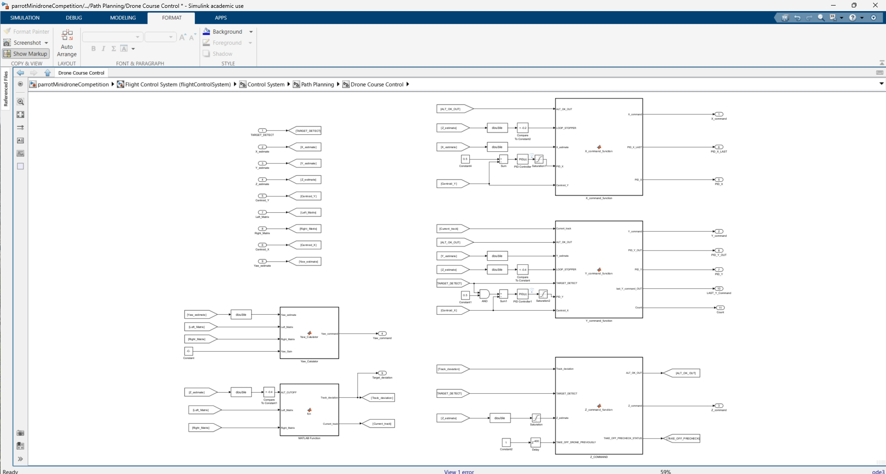
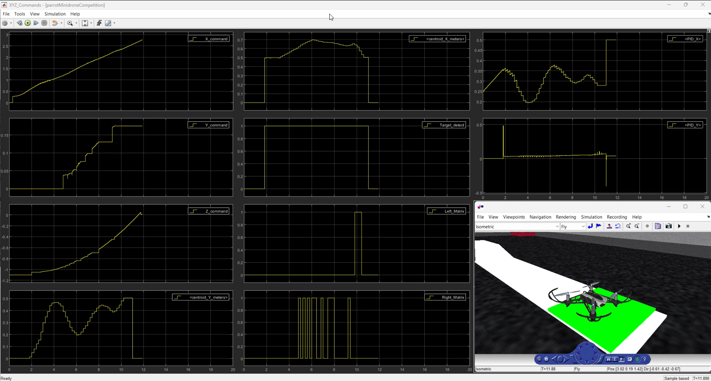

# Autonomous Drone Landing on Moving Target

This image demonstrates the drone's view and the image processing results:

Raw camera feed showing the moving platform (white line with green target)
Processed image highlighting the detected green landing pad
Additional windows for detailed image analysis and debugging

This project implements an autonomous landing system for a Parrot Mambo drone on a moving target, developed at Arizona State University.

## Project Structure

- \`parrotMinidrone/\`: Source code with Flight Control System (FCS), Image Processing Unit (IPU), Landing Function and all other dependencies are in this folder.
- \`mainModels/\`: This folder contains the main ".slx" file which open to the project
- \`Image_data_ref/\`: COntains the Image for Image Processing
- \`results/\`: Performance graphs and demo videos

## Path Planning

This detailed Simulink model shows the integration of various subsystems:

State estimation and error calculation
Path planning algorithms for drone course control
Landing logic implementation
Integration of image processing data with control systems

## Drone Course Control System 

This Simulink model illustrates the high-level control system for the drone:

Input processing for various control signals
Integration of path planning and flight control subsystems
Command generation for the drone's actuators

## Results

This image shows the real-time performance graphs of various system parameters:

X, Y, and Z position commands and actual positions
Altitude and yaw control
Target detection status
Motor control signals

## Contributing

[Include contribution guidelines here]

## Acknowledgements

- MathWorks for Simulink MATLAB
